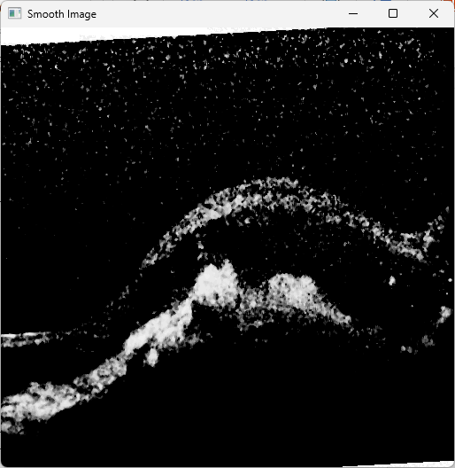
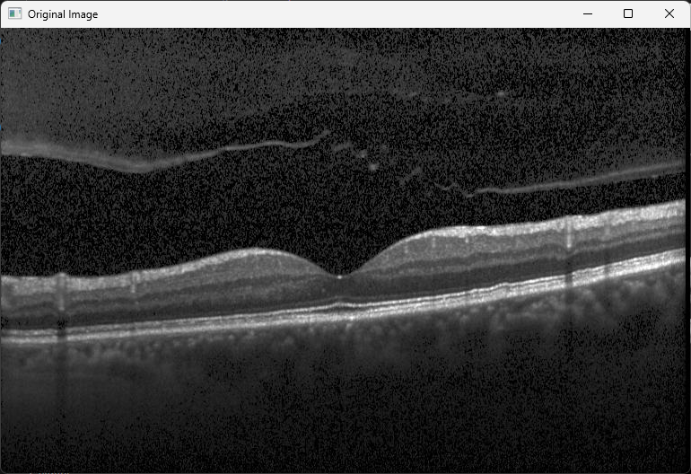

# Project Objective

The goal of this project is to design and implement digital image processing techniques to enhance the detection of retinal diseases using OCT (Optical Coherence Tomography) images. These images allow ophthalmologists to closely observe each layer of the retina, facilitating the diagnosis of various conditions. This approach enables the use of OCT images to develop predictive models for classifying patients into different categories.

|  |  |
|-----------------------------|-----------------------------|

|  |  |
|-----------------------------|-----------------------------|

---

## Project Data

This project uses the **"Retinal OCT Feature Map and Filters Visualization"** dataset, which includes the following data splits:

- **Train**: 83,484 images distributed across 4 classes:
  - CNV: 37,205 images
  - DME: 11,348 images
  - DRUSEN: 8,616 images
  - NORMAL: 26,315 images

- **Test**: 968 images evenly distributed across 4 classes:
  - CNV: 242 images
  - DME: 242 images
  - DRUSEN: 242 images
  - NORMAL: 242 images

- **Val**: 32 images distributed across 4 classes.
  - CNV: 8 images
  - DME: 8 images
  - DRUSEN: 8 images
  - NORMAL: 8 images

The images have relatively low resolution, variable dimensions, and noise in the form of spots and white borders.

**CNV Original and preprocessed images**
|  |  |
|-----------------------------|-----------------------------|

**DME Original and preprocessed images**
|  |  |
|-----------------------------|-----------------------------|

**DRUSEN Original and preprocessed images**
|  |  |
|-----------------------------|-----------------------------|

**NORMAL Original and preprocessed images**
|  |  |
|-----------------------------|-----------------------------|

---

## Usage Instructions

1. **Dataset Download:**
   - To obtain the dataset, visit the Kaggle page at the following link: [Retinal OCT Feature Map and Filters Visualization](https://www.kaggle.com/code/justforgags/retinal-oct-feature-map-and-filters-visualization/input).

2. **Dataset Organization:**
   - After downloading the dataset, place the **Train**, **Test**, and **Val** folders inside the project's repository directory.

3. **Code Configuration:**
   - In the main code file, ensure you update the directory paths to match the folder locations on your system. This will prevent issues when loading the data.
